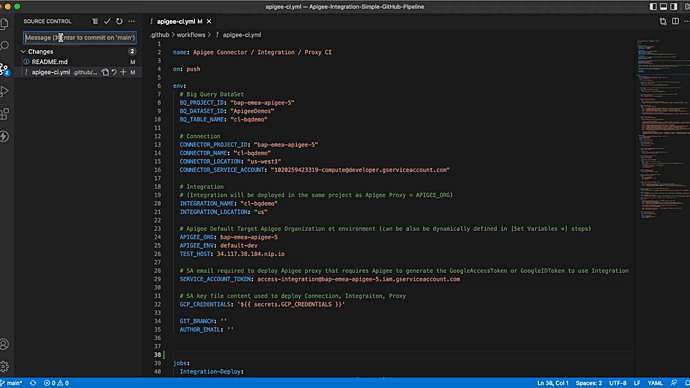

   


# Apigee Simple Github End-to-End Pipeline for Apigee proxy with Integration target.

**This is not an official Google product.**<BR>This implementation is not an official Google product, nor is it part of an official Google product. Support is available on a best-effort basis via GitHub.

***

## Goal

Simple implementation for a CI/CD pipeline for Apigee Proxy with Integration target using GitHub repository, 
[CI/CD with GitHub](https://docs.GitHub.com/ee/ci/introduction/) and gcloud command (GitHub Action).
The pipeline deploys a Google BigQuery Connector, An Apigee Integration Workflow and an Apigee Proxy as illustrated hereunder:


The CICD pipeline includes:

- Deployment of the Apigee Connection and Apigee Integration using [acidt](https://github.com/g-lalevee/apigee-acidt) (requires [setup-gcloud GitHub Action](https://github.com/google-github-actions/setup-gcloud))
- Packaging and deployment of the API proxy bundle using [Apigee Deploy Maven Plugin](https://github.com/apigee/apigee-deploy-maven-plugin)
- Integration testing of the deployed proxy using [apickli](https://github.com/apickli/apickli)


This repository contains:

```sh
.
└── .github / workflows                                   : GitHub pipeline file
|   └── ...
└── apiproxy                                              : Apigee API proxy 
|   └── ...
└── bq-sample-data                                        : Data and script to create BQ sample data
|   └── ...
└── connection                                 
|   └── connection-bq-template.json                       : Apigee BQ Connection configuration file variabilized
└── integration    
|   └──  integration-bq-template.json                     : Apigee Integration configuration file variabilized
└── test                                                  : Apickli (integration test) 
    └── ...
```

---
**NOTE**

`connection/connection-bq-template.json` and `integration/integration-bq-template.json` have been variabilized to allow the choice of names and target regions during deployment.

---


## Setup

### Google Cloud Service Accounts

3 Google Cloud Service Accounts are required to run this pipeline.

1. Google Cloud Service Account for Apigee Connection

Connection instance requires authentication credentials to access to BigQuery provided with a Google Service Account.
Detailed descriptions of the authentication configurations required for BigQuery can be found in [Documentation](https://cloud.google.com/apigee/docs/api-platform/connectors/configure-bigquery#before-you-begin).
Creating this service account is necessary: it will we asked to deploy Apigee BigQuery Connection (Variable `CONNECTOR_SERVICE_ACCOUNT` in **apigee-ci.yml** file).


2. Google Cloud Service Account for Apigee Proxy

If an API Proxy makes a callout to a Google API, Apigee X now supports generating the access token or ID Token by just passing the service account email to the deployment API. For more info check out [Using Google authentication using Apigee](https://cloud.google.com/apigee/docs/api-platform/security/google-auth/overview).

So, Apigee Proxy with Integration target, used in this pipeline sample, need it.
Create a service account authorizing the call of Apigee Integration Trigger (permissions: integrations.apigeeIntegrations.invoke, resourcemanager.projects.get): it will we asked to deploy Apigee Proxy (Variable `SERVICE_ACCOUNT_TOKEN` in **apigee-ci.yml** file).


3. Google Cloud Service Account for API Proxy Deployment


Deployments of Apigee Connection, Apigee Integration and Apigee Proxy require a GCP Service Account with the following roles (or a custom role with all required permissions):

- Apigee Environment Admin
- Apigee API Admin
- Apigee Integration Admin
- Connector Admin
- Service Account Token Creator (required by setup-gcloud GitHub Action)
- Service Account User (required for Google Cloud Service Account for Apigee Proxy)


To create it in your Apigee organization's GCP project, use following gcloud commands (or GCP Web UI):

```sh
SA_NAME=<your-new-service-account-name>

gcloud iam service-accounts create $SA_NAME --display-name="GitHub-ci Service Account"

PROJECT_ID=$(gcloud config get-value project)
GitHub_SA=$SA_NAME@$PROJECT_ID.iam.gserviceaccount.com

gcloud projects add-iam-policy-binding "$PROJECT_ID" \
  --member="serviceAccount:$GitHub_SA" \
  --role="roles/apigee.environmentAdmin"

gcloud projects add-iam-policy-binding "$PROJECT_ID" \
  --member="serviceAccount:$GitHub_SA" \
  --role="roles/apigee.apiAdmin"

gcloud projects add-iam-policy-binding "$PROJECT_ID" \
  --member="serviceAccount:$GitHub_SA" \
  --role="roles/integrations.apigeeIntegrationAdminRole"

gcloud projects add-iam-policy-binding "$PROJECT_ID" \
  --member="serviceAccount:$GitHub_SA" \
  --role="roles/roles/connectors.admin"

gcloud projects add-iam-policy-binding "$PROJECT_ID" \
  --member="serviceAccount:$GitHub_SA" \
  --role="roles/iam.serviceAccountTokenCreator"

gcloud projects add-iam-policy-binding "$PROJECT_ID" \
  --member="serviceAccount:$GitHub_SA" \
  --role="roles/iam.serviceAccountUser"

gcloud iam service-accounts keys create $SA_NAME-key.json --iam-account=$GitHub_SA --key-file-type=json 

```

Copy `<your-new-service-account-name>-key.json` file content to clipboard. 


### GitHub

1. Initialize Repository

Create a GitHub repository to clone this repository. 
git@github.com:g-lalevee/Apigee-Integration-Simple-GitHub-Pipeline.git

To use the `Apigee-Integration-Simple-GitHub-Pipeline` in your GitHub repository like `github.com/my-user/my-api-proxy-repo`, follow these steps:

```bash
git clone git@github.com:g-lalevee/Apigee-Integration-Simple-GitHub-Pipeline.git
cd Apigee-Integration-Simple-GitHub-Pipeline
git init
git remote add origin git@github.com:my-user/my-api-proxy.git
git checkout -b feature/cicd-pipeline
git add .
git commit -m "initial commit"
git push -u origin feature/cicd-pipeline
```


2. Secret Configuration 

Add GitHub secrets `GCP_CREDENTIALS` to store your GCP Service Account json key:
- Go to your repository’s **Settings** > **Secrets** > **Action**.
- Click the **New Repository Secret** button.<BR>Fill in the details:
  - Name: GCP_CREDENTIALS
  - Value: paste the GCP Service Account file content, copied step before
  - Click the **Add secret** button

### Big Query

The Apigee Integration deployed by this sample exposes a BigQuery dataset and table containing a list of products.
The `bq-sample-data` folder contains script and data to create products table in your BigQuery.

Update the `./bq-sample-data/setup_bigquery.sh` file with your values (don't change table name):

```lang-shell
export BQ_PROJECT_ID="YOUR_PROJECT"
export BQ_DATASET_ID="YOUR_DATASET"
export BQ_DATASET_LOCATION="YOUR_REGION"
```

Run the `./bq-sample-data/setup_bigquery.sh` shell script to create the Dataset and table. It outputs the entries from the table which contains multiple products.
Output:

```
./bq-sample-data/setup_bigquery.sh

Create BQ table "products" using GCP project "xxxxx" and dataset "xxxxx"
Upload complete.
Waiting on bqjob_r215f34382d4bf9c2_000001807208f446_1 ... (1s) Current status: DONE   
+------------+-----------------------+--------------------------------------------------------------------------------+---------------------------------+----------+-------------+
|     id     |         name          |                                  description                                   |             picture             | priceUsd | categories  |
+------------+-----------------------+--------------------------------------------------------------------------------+---------------------------------+----------+-------------+
| 0PUK6V6EV0 | Vintage Record Player | It still works.                                                                | /img/products/record-player.jpg |     65.5 | music       |
| 9SIQT8TOJO | City Bike             | This single gear bike probably cannot climb the hills of San Francisco.        | /img/products/city-bike.jpg     |    789.5 | cycling     |
| OLJCESPC7Z | Vintage Typewriter    | This typewriter looks good in your living room.                                | /img/products/typewriter.jpg    |    67.98 | vintage     |
| 1YMWWN1N4O | Home Barista Kit      | Always wanted to brew coffee with Chemex and Aeropress at home?                | /img/products/barista-kit.jpg   |   123.99 | cookware    |
| LS4PSXUNUM | Metal Camping Mug     | You probably don't go camping that often but this is better than plastic cups. | /img/products/camp-mug.jpg      |    24.33 | cookware    |
| L9ECAV7KIM | Terrarium             | This terrarium will looks great in your white painted living room.             | /img/products/terrarium.jpg     |    34.44 | gardening   |
| 6E92ZMYYFZ | Air Plant             | Have you ever wondered whether air plants need water? Buy one and figure out.  | /img/products/air-plant.jpg     |    12.29 | gardening   |
| 66VCHSJNUP | Vintage Camera Lens   | You won't have a camera to use it and it probably doesn't work anyway.         | /img/products/camera-lens.jpg   |    12.48 | photography |
| 2ZYFJ3GM2N | Film Camera           | This camera looks like it's a film camera, but it's actually digital.          | /img/products/film-camera.jpg   |  2244.99 | photography |
+------------+-----------------------+--------------------------------------------------------------------------------+---------------------------------+----------+-------------+

Table created
```

## Run the pipeline

Using your favorite IDE...
1.  Update the **.github/workflows/apigee-ci.yml** file.<BR>
In **"env"** section (workflow level)...
    - BigQuery Variables
        - change `BQ_PROJECT_ID` value by your source BigQuery GCP project name
        - change `BQ_DATASET_ID` value by your source BigQuery Dataset name
        - change `BQ_TABLE_NAME` value by your source BigQuery table name
    - Connection Variables
        - change `CONNECTOR_PROJECT_ID` value by your Connection GCP project name
        - change `CONNECTOR_NAME` value by your Connection name
        - change `CONNECTOR_LOCATION` value by your Connection deployment region name
        - change `CONNECTOR_SERVICE_ACCOUNT` value by your Connection Google Cloud Service Account (BQ Access credentials)
    - Integration Variables
        - change `INTEGRATION_NAME` value by your Integration name
        - change `INTEGRATION_LOCATION` value by your Integration deployment region name
    - Apigee Proxy Variables
        - change `APIGEE_ORG` value by your Apigee organization name
        - change `APIGEE_ENV` value by your Apigee environment name
        - change `TEST_HOST` value by the API hostname
        - change `SERVICE_ACCOUNT_TOKEN` value by the Google Cloud Service Account for Apigee Proxy to call Google API

3. Save
4. Commit, Push.. et voila!

Use the GitHub UI to monitor your pipeline execution:

- Go to your GitHub repository > **Actions** (tab). You can see your workflow running.<BR>
At the end, from **Action > Summary** menu, download apicki test results (html format).




