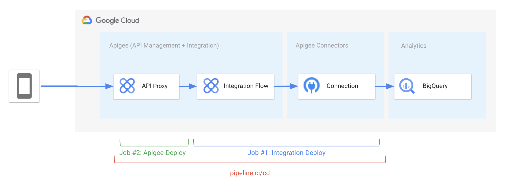

   

# Apigee Simple Github End-to-End Pipeline for Apigee proxy with Integration target.

**This is not an official Google product.** This implementation is not an official Google product, nor is it part of an official Google product. Support is available on a best-effort basis via GitHub.

***

## Goal

Simple implementation for a CI/CD pipeline for Apigee Proxy with Integration target using GitHub repository, 
[CI/CD with GitHub](https://docs.GitHub.com/ee/ci/introduction/) and gcloud command (GitHub Action).
The pipeline deploys a Google BigQuery Connector, An Apigee Integration Workflow and an Apigee Proxy as illustrated hereunder:

The CICD pipeline includes:

- Deployment of the Apigee Connection and Apigee Integration using [acidt](https://github.com/g-lalevee/apigee-acidt) (requires [setup-gcloud GitHub Action](https://github.com/google-github-actions/setup-gcloud))
- Packaging and deployment of the API proxy bundle using [Apigee Deploy Maven Plugin](https://github.com/apigee/apigee-deploy-maven-plugin)
- Integration testing of the deployed proxy using [apickli](https://github.com/apickli/apickli)

